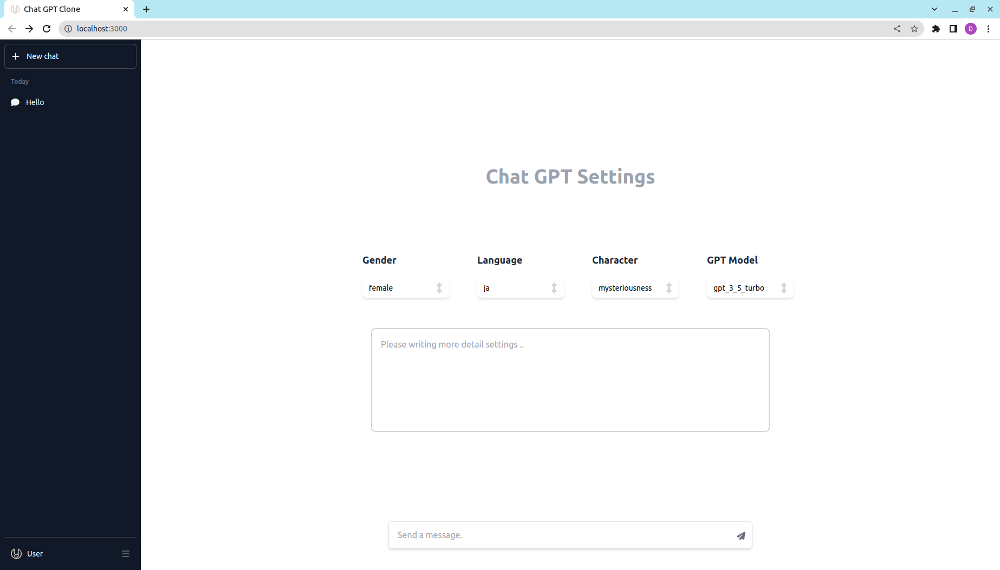
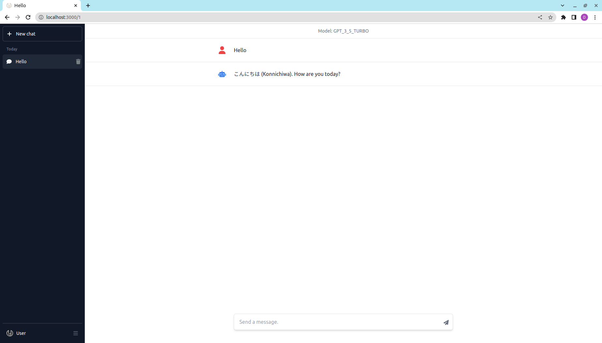

# chat-app
### Home View

### Chat View


## Overview
Chat-App is a chatbot application developed with OpenAI's API. It employs a user-friendly interface and leverages the power of artificial intelligence to provide dynamic and interactive conversation experiences.

## Installation
To set up and run Chat-App, follow these steps:

### Back-end
The back-end runs on FastAPI, and you'll need to install **poetry** to manage the Python dependencies.

Navigate to the back-end directory:
```
cd chat-app-back
```

Start the FastAPI server with:
```
poetry run uvicorn main:app --reload
```

### Front-end
The front-end is a Next.js application.

Navigate to the front-end directory:
```
cd chat-app-front
```

Build the application with:
```
npm run build
```

Start the application with:
```
npm run start
```

## Tech Stack

### Front-end
- Next.js 13.4.1
- TypeScript 5.0.4
- Tailwind 3.3.2

### Back-end
- Python 3.10.10
- FastAPI 0.95.1
- Poetry 1.4.2

## License
This project is licensed under the terms of the MIT license.

## Author
Yorimichi (yorimichi.dev@gmail.com)
